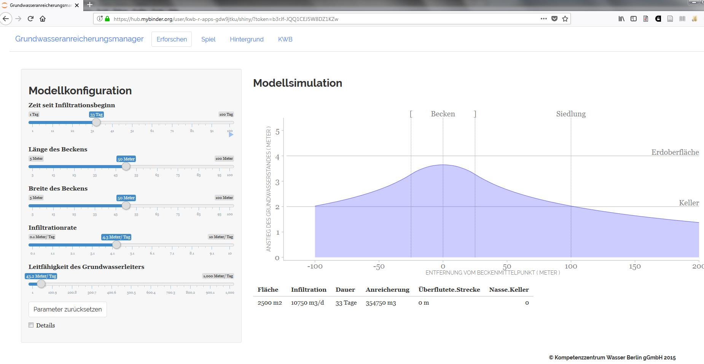

# apps

Interactive Apps

The following apps are based on the following different R packages 

## [kwb.hantush](https://kwb-r.github.io/kwb.hantush)

An R package for calculating groundwater mounding beneath an infiltration basin
based on the [Hantush equation, 1967](http://doi.org/10.1029/WR003i001p00227)

### GWAmanager (in German) 

